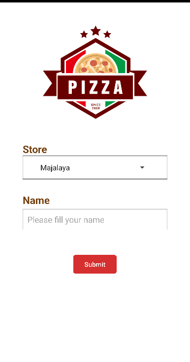
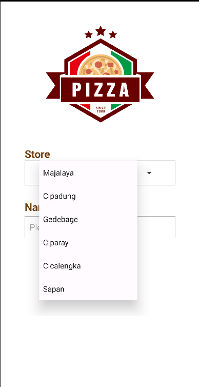
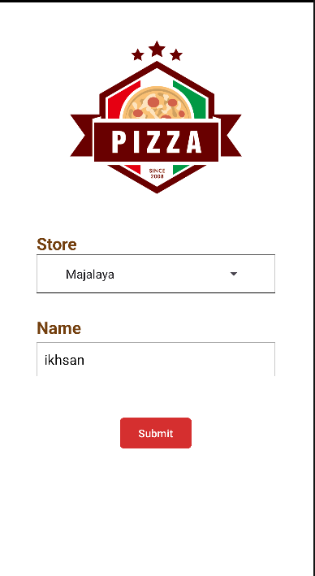
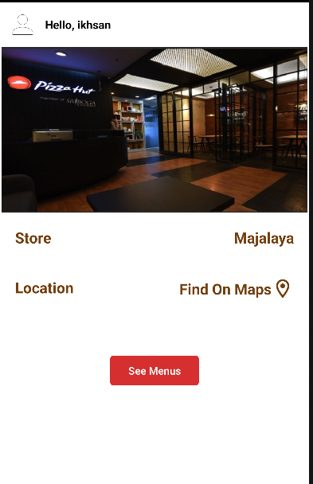
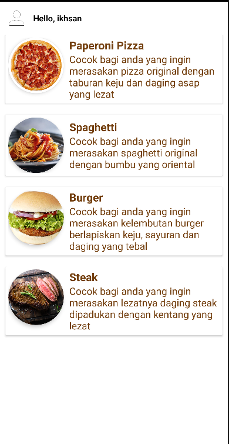
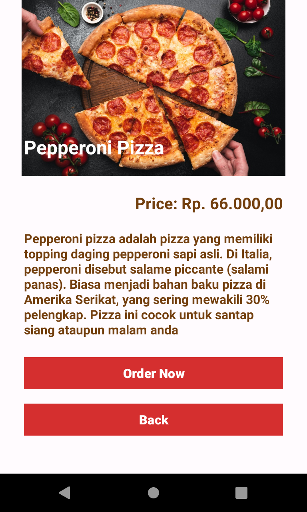
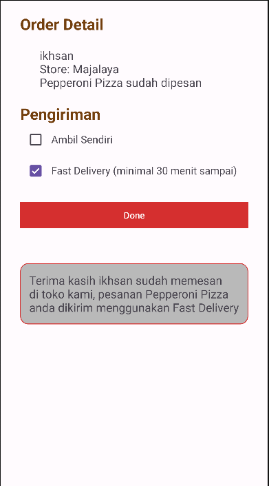

## UTS Prak PAM

**Nama**: Muhammad Ikhsan Nurhalim

**NIM**: 1217050097

**Kelas**: Teknik Informatika 2021

**Mata Kuliah**: Praktikum Pengembangan Aplikasi Mobile B

### Deskripsi

Pizza Shop merupakan aplikasi demo pemesanan Pizza secara online, aplikasi ini dibuat dengan desain yang telah diberikan dosen yang merupakan tugas UTS mata kuliah Pengembangan Aplikasi Mobile.

### Screenshot Aplikasi

- **Form page**

- **Confirm Location page**

- **Menu Pizza page**

- **Pizza Detail page**

- **Order Detail page**

### Link Source code

Link sourcode : [https://github.com/fikiap23/UTS-PAM_Pizza.git](https://github.com/ikhsannhlm/pizza_shop.git)

### Kontak

Wa : [+62 8810221 00630](https://wa.me/881022100630)
Instagram: [@ikhsannhlm_](https://instagram.com/ikhsannhlm_)
Website: [Muhammad Ikhsan N](https://ikhsan.github.io/cv)